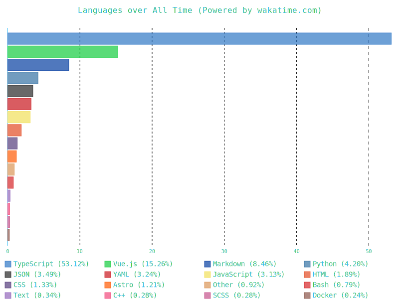
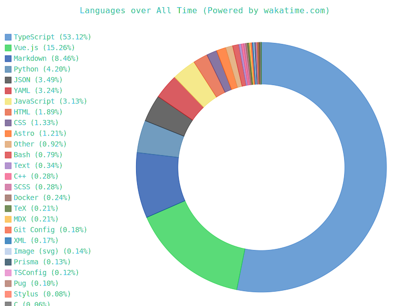
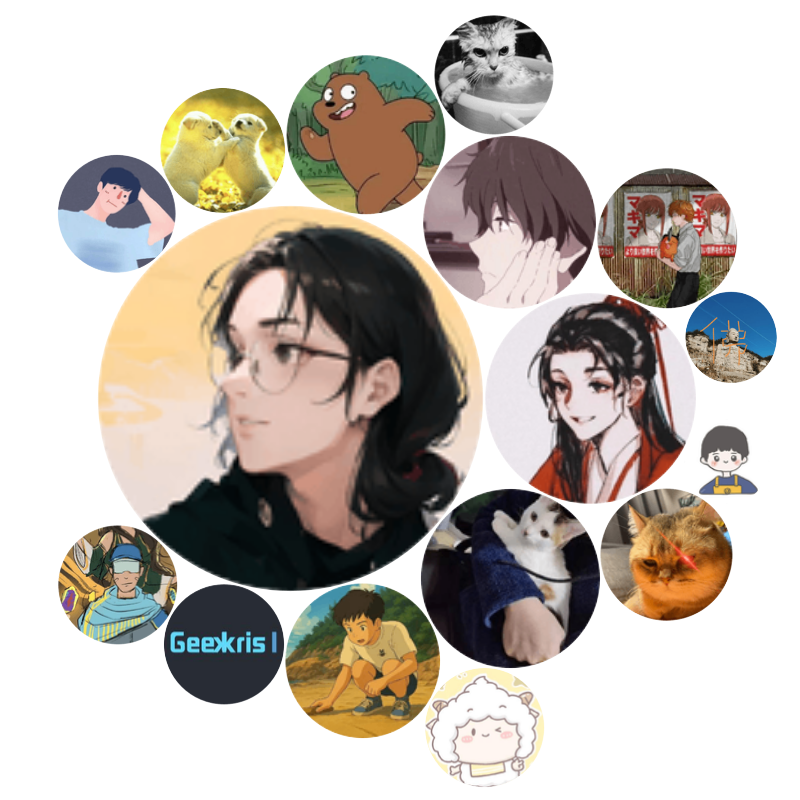

<h1 align="center">
  
</h1>

  
<!-- Social Links -->

<!-- Visitor Counter -->

 

<!-- GitHub Stats -->

<picture>
  <source media="(prefers-color-scheme: light)" srcset="https://pixel-profile.vercel.app/api/github-stats?username=Simon-He95&screen_effect=false&background=linear-gradient(to%20bottom%20right%2C%20%2374dcc4%2C%20%234597e9)">
  <source media="(prefers-color-scheme: dark)" srcset="https://pixel-profile.vercel.app/api/github-stats?username=Simon-He95&screen_effect=true&background=linear-gradient(to%20bottom%20right%2C%20%235580eb%2C%20%232aeeff)">
  
</picture>

 

<!-- 3D Contribution Graph -->

  

 

---

## 🚀 Open Source Projects

### 📦 Tools & Utilities

<table width="100%">
<tr>
<td width="50%" valign="top">

#### [lazy-js-utils](https://github.com/Simon-He95/lazy-js-utils)

**🔧 JavaScript Utility Library**  
`JavaScript` `Utility` `TypeScript`  
Practical JavaScript utility functions collection to boost development efficiency

</td>
<td width="50%" valign="top">

#### [unot](https://github.com/Simon-He95/unot)

**🎨 UnoCSS Toolkit**  
`UnoCSS` `VSCode` `CSS`  
Complete UnoCSS toolkit in VSCode, one-stop atomic CSS solution

</td>
</tr>
</table>

### 🔧 VSCode Extensions

<table width="100%">
<tr>
<td width="50%" valign="top">

#### [vscode-common-intellisense](https://github.com/Simon-He95/vscode-common-intellisense)

**🧠 Universal Component IntelliSense**  
`VSCode` `IntelliSense` `Vue` `React`  
Universal Component Intellisense for Any Frameworks

</td>
<td width="50%" valign="top">

#### [vscode-tailwind-magic](https://github.com/Simon-He95/vscode-tailwind-magic)

**✨ TailwindCSS Magic Plugin**  
`TailwindCSS` `VSCode` `CSS`  
A magic plugin that brings convenience to TailwindCSS usage

</td>
</tr>
<tr>
<td width="50%" valign="top">

#### [markstream-vue](https://github.com/Simon-He95/markstream-vue)

**🔮 Vue Component Prompter**  
`Vue` `VSCode` `IntelliSense`  
Dynamically provide properties and events for custom components

</td>
<td width="50%" valign="top">

#### [transformToUnocss](https://github.com/Simon-He95/transformToUnocss)

**🔄 CSS Transform Tool**  
`UnoCSS` `CSS` `Transform`  
Transform CSS to UnoCSS syntax with one click migration

</td>
</tr>
</table>

### 🌐 Web Applications & Tools

<table width="100%">
<tr>
<td width="50%" valign="top">

#### [simon.me](https://github.com/Simon-He95/simon.me)

**📝 Personal Blog**  
`Blog` `Vue` `Nuxt`  
Simon's personal blog - documenting technology and life

</td>
<td width="50%" valign="top">

#### [browser-compress-image](https://github.com/Simon-He95/browser-compress-image)

**🖼️ Image Compression Tool**  
`Image` `Compression` `Browser`  
Lightweight, high-performance browser image compression library

</td>
</tr>
</table>

---

## 📊 GitHub Statistics

---

## 🛠️ Tech Stack

### 💻 Operating System & Browser

### 🔧 Development Tools

### 🚀 Tech Stack Animation

  
  
  
  
  
  
  
  

---

## 📈 GitHub Activity

<!-- Snake Game -->

  

 

<!-- GitHub Activity Graph -->

  

---

## ⏱️ Coding Time Statistics

  
  

---

## 💖 Support My Work

### If my work has helped you, you can buy me a coffee ☕️

### 💎 Sponsors

  

---

  <h3>🌟 Thanks for visiting! Looking forward to creating a better open source world together!</h3>
  
  
  
  

