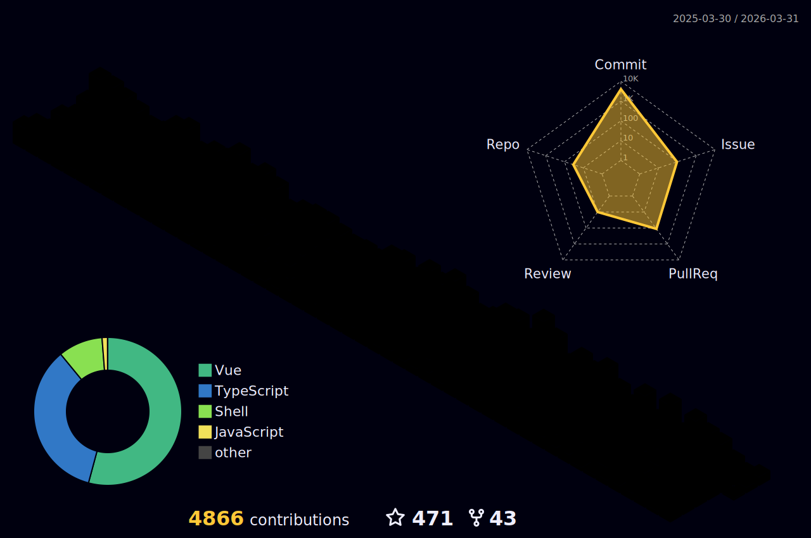

<div align="center">

```text
███████╗██╗███╗   ███╗ ██████╗ ███╗   ██╗        ██╗  ██╗███████╗
██╔════╝██║████╗ ████║██╔═══██╗████╗  ██║        ██║  ██║██╔════╝
███████╗██║██╔████╔██║██║   ██║██╔██╗ ██║  █████╗███████║█████╗
╚════██║██║██║╚██╔╝██║██║   ██║██║╚██╗██║  ╚════╝██╔══██║██╔══╝
███████║██║██║ ╚═╝ ██║╚██████╔╝██║ ╚████║        ██║  ██║███████╗
╚══════╝╚═╝╚═╝     ╚═╝ ╚═════╝ ╚═╝  ╚═══╝        ╚═╝  ╚═╝╚══════╝
```


</div>

<p align="center">
  <a href="https://www.hejian.club/"></a>
  <a href="https://twitter.com/simon_he1995"></a>
  <a href="https://space.bilibili.com/413596956"></a>
  <a href="https://www.npmjs.com/~simon_he"></a>
</p>

<p align="center">
  
</p>

## [SYSTEM] Identity

```bash
$ whoami
Simon He (Simon-He95)

$ cat /etc/roles
Frontend Engineer
Tooling Builder
Open Source Maintainer

$ cat /etc/focus
- performance tuning
- build workflow automation
- practical developer experience
```

## [SYSTEM] Arsenal

<p align="center">
  
</p>

## [SYSTEM] Featured Repos

<p align="center">
  <a href="https://github.com/Simon-He95/simon-js-tool"></a>
  <a href="https://github.com/Simon-He95/tiny-tinify-compress"></a>
  <a href="https://github.com/Simon-He95/browser-compress-image"></a>
  <a href="https://github.com/Simon-He95/transformToUnocss"></a>
</p>

## [SYSTEM] Contribution Matrix

<p align="center">
  
</p>

<p align="center">
  
</p>

## [SYSTEM] Core Telemetry

<p align="center">
  
</p>

<p align="center">
  
  
  
  
</p>

## [SYSTEM] Live External Feeds

<p align="center">
  
</p>

<p align="center">
  
  
</p>

<p align="center">
  
</p>

<div align="center">

```text
[daemon] svg-sync.service ............... active (runs every 6h via GitHub Actions)
```

</div>

## [SYSTEM] Sponsor

```bash
$ support --creator Simon-He95
```

[Buy me a cup of coffee](https://github.com/Simon-He95/sponsor)
