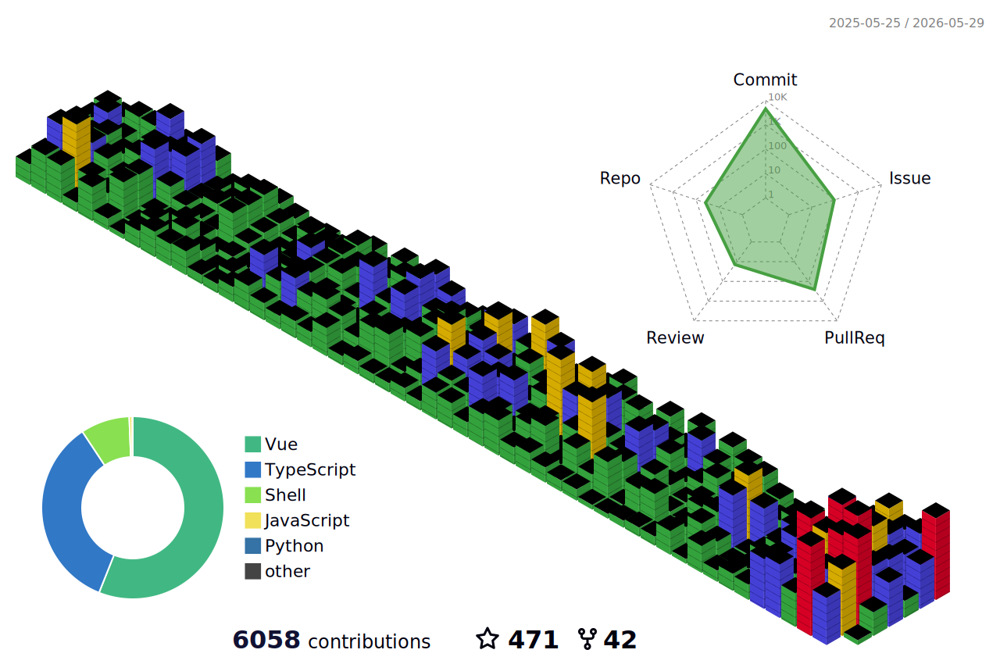

<div align="center">
  <a href="https://www.simonhe.me">
    
  </a>

  <p>
    <a href="https://www.simonhe.me"></a>
    <a href="https://github.com/Simon-He95"></a>
    <a href="https://twitter.com/simon_he1995"></a>
    <a href="https://juejin.cn/user/4319334608151533"></a>
    <a href="https://discord.gg/x3MSjy5S5G"></a>
  </p>

  <h3>Frontend engineer cooking for DX</h3>
  <p><em>Create for laziness, peace & love ❤️</em></p>

  <p>
    <code>Vue</code> · <code>TypeScript</code> · <code>Vite</code> · <code>UnoCSS</code> · <code>VS Code Extensions</code> · <code>Automation</code>
  </p>
</div>

---

## 👋 About

I’m **Simon He**, a frontend engineer based in Shanghai. I build practical open-source tools for real workflows — from AI-friendly streaming Markdown renderers and UnoCSS utilities to VS Code extensions and browser-side productivity tools.

```ts
const simon = {
  location: 'Shanghai',
  focus: ['DX', 'Frontend Tooling', 'Open Source', 'Automation'],
  stack: ['Vue', 'TypeScript', 'Vite', 'UnoCSS', 'TailwindCSS', 'VS Code'],
  principle: 'Create for laziness, peace & love ❤️',
}
```

<table>
  <tr>
    <td width="33%"><b>⚡ DX first</b><br /><sub>Make daily frontend work faster and calmer.</sub></td>
    <td width="33%"><b>🧰 Tooling driven</b><br /><sub>Ship small, composable tools for real workflows.</sub></td>
    <td width="33%"><b>🌱 Open source</b><br /><sub>Build in public, learn from users, iterate quickly.</sub></td>
  </tr>
</table>

---

## ✨ Featured Projects

<table>
  <tr>
    <td width="50%" valign="top">
      <h3><a href="https://github.com/Simon-He95/markstream-vue">markstream-vue</a></h3>
      <p>A Vue 3 renderer built for AI-powered streaming Markdown: progressive Mermaid, Monaco/Shiki code blocks, KaTeX, virtual rendering, and real-time updates without jitter.</p>
      <p>
        <a href="https://github.com/Simon-He95/markstream-vue"></a>
        <a href="https://www.npmjs.com/package/markstream-vue"></a>
      </p>
      <p><code>Vue 3</code> <code>AI UI</code> <code>Markdown</code> <code>Mermaid</code> <code>KaTeX</code></p>
    </td>
    <td width="50%" valign="top">
      <h3><a href="https://github.com/Simon-He95/common-intellisense">common-intellisense</a></h3>
      <p>Universal component IntelliSense for multiple UI libraries. It provides smart completion for props, events, slots, types, and instance methods.</p>
      <p>
        <a href="https://github.com/Simon-He95/common-intellisense"></a>
        <a href="https://marketplace.visualstudio.com/items?itemName=simonhe.common-intellisense"></a>
      </p>
      <p><code>VS Code</code> <code>IntelliSense</code> <code>UI Libraries</code> <code>DX</code></p>
    </td>
  </tr>
  <tr>
    <td width="50%" valign="top">
      <h3><a href="https://github.com/Simon-He95/transformToUnoCSS">transformToUnoCSS</a></h3>
      <p>Convert traditional CSS into UnoCSS utilities. Useful for migrating copied styles, design drafts, and legacy CSS snippets into atomic CSS workflows.</p>
      <p>
        <a href="https://github.com/Simon-He95/transformToUnoCSS"></a>
      </p>
      <p><code>UnoCSS</code> <code>CSS Transform</code> <code>Atomic CSS</code> <code>Migration</code></p>
    </td>
    <td width="50%" valign="top">
      <h3><a href="https://github.com/Simon-He95/unot">unot</a></h3>
      <p>UnoCSS tools for VS Code. Hover CSS hints, shortcut conversion, uno-magic syntax expansion, and faster atomic CSS authoring.</p>
      <p>
        <a href="https://github.com/Simon-He95/unot"></a>
      </p>
      <p><code>UnoCSS</code> <code>VS Code</code> <code>Productivity</code> <code>Tooling</code></p>
    </td>
  </tr>
</table>

### More Open Source

| Project | What it does |
| --- | --- |
| [`lazy-js-utils`](https://github.com/Simon-He95/lazy-js-utils) | JavaScript / TypeScript utility toolkit for practical browser and DOM workflows. |
| [`vscode-tailwind-magic`](https://github.com/Simon-He95/vscode-tailwind-magic) | TailwindCSS productivity extension with shorthand expansion and smart conversion. |
| [`simon.me`](https://github.com/Simon-He95/simon.me) | Personal blog and content platform. |
| [`browser-compress-image`](https://github.com/Simon-He95/browser-compress-image) | Browser-side image compression experiment; archived and kept for reference. |

---

## 🧩 Tech Stack

<div align="center">
  
</div>

---

## 📊 GitHub Overview

<div align="center">
  
  
</div>

<details>
  <summary><b>More activity graphs</b></summary>
  <br />
  <div align="center">
    
    
    
    <picture>
      <source media="(prefers-color-scheme: dark)" srcset="./profile-snake-contrib/github-contribution-grid-snake-dark.svg" />
      <source media="(prefers-color-scheme: light)" srcset="./profile-snake-contrib/github-contribution-grid-snake.svg" />
      
    </picture>
  </div>
</details>

---

## ☕ Support

If my projects help your workflow, a star, issue, PR, feedback, or sponsorship means a lot.

<div align="center">
  <a href="https://github.com/sponsors/Simon-He95"></a>
  <br /><br />
  
</div>
