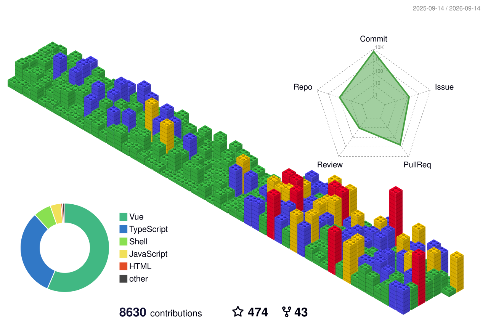

<div align="center">
  <a href="https://www.simonhe.me">
    
  </a>

  <p>
    <a href="https://www.simonhe.me"></a>
    <a href="https://github.com/Simon-He95"></a>
    <a href="https://twitter.com/simon_he1995"></a>
    <a href="https://juejin.cn/user/4319334608151533"></a>
    <a href="https://discord.gg/x3MSjy5S5G"></a>
  </p>

  <h3>Agent &amp; frontend engineer cooking for DX</h3>
  <p><em>Create for laziness, peace & love ❤️</em></p>

  <p>
    <code>Agent Harness</code> · <code>TUI</code> · <code>Electron</code> · <code>Vue</code> · <code>TypeScript</code> · <code>Streaming Markdown</code> · <code>DX</code>
  </p>
</div>

---

## 👋 About

I’m **Simon He**, an engineer based in Shanghai. I build agent infrastructure and developer tooling for real workflows — from AI agent harnesses and terminal UIs to Electron desktop apps and AI-friendly streaming Markdown renderers.

```ts
const simon = {
  location: 'Shanghai',
  focus: ['Agent Harness', 'TUI', 'Electron', 'Streaming UI', 'DX'],
  stack: ['TypeScript', 'Vue', 'Electron', 'Node.js', 'Vite', 'UnoCSS'],
  principle: 'Create for laziness, peace & love ❤️',
}
```

<table>
  <tr>
    <td width="33%"><b>⚡ DX first</b><br /><sub>Build tools that make daily work faster and calmer.</sub></td>
    <td width="33%"><b>🧰 Tooling driven</b><br /><sub>Ship small, composable tools for real workflows.</sub></td>
    <td width="33%"><b>🌱 Open source</b><br /><sub>Build in public, learn from users, iterate quickly.</sub></td>
  </tr>
</table>

---

## ✨ Featured Projects

<table>
  <tr>
    <td width="50%" valign="top">
      <h3><a href="https://github.com/Simon-He95/best-agent">best-agent</a></h3>
      <p>A TypeScript agent harness: AgentKernel, EffectRunner, model bindings (OpenAI / Anthropic / Google), subagents, workflows, interactive TUI chat, and an ACP-compatible server.</p>
      <p>
        <a href="https://github.com/Simon-He95/best-agent"></a>
      </p>
      <p><code>Agent Harness</code> <code>TypeScript</code> <code>LLM</code> <code>TUI</code> <code>ACP</code></p>
    </td>
    <td width="50%" valign="top">
      <h3><a href="https://github.com/Simon-He95/markstream-vue">markstream-vue</a></h3>
      <p>Multi-framework streaming Markdown renderers for AI apps: Vue/Nuxt, React/Next.js, Svelte, and Angular — progressive Mermaid, Monaco/Shiki code blocks, KaTeX, and low-jitter real-time updates.</p>
      <p>
        <a href="https://github.com/Simon-He95/markstream-vue"></a>
        <a href="https://www.npmjs.com/package/markstream-vue"></a>
      </p>
      <p><code>Vue 3</code> <code>React</code> <code>Svelte</code> <code>Angular</code> <code>AI UI</code> <code>Markdown</code> <code>Mermaid</code> <code>KaTeX</code></p>
    </td>
  </tr>
  <tr>
    <td width="50%" valign="top">
      <h3><a href="https://github.com/Simon-He95/vue-tui">vue-tui</a></h3>
      <p>A Vue 3 terminal UI toolkit that renders one component model to browser DOM, CLI stdout, and headless tests — built for agent consoles, streaming markdown transcripts, log viewers, and virtual lists.</p>
      <p>
        <a href="https://github.com/Simon-He95/vue-tui"></a>
        <a href="https://www.npmjs.com/package/@simon_he/vue-tui"></a>
      </p>
      <p><code>Vue 3</code> <code>TUI</code> <code>Terminal UI</code> <code>ANSI</code> <code>Agent Console</code></p>
    </td>
    <td width="50%" valign="top">
      <h3><a href="https://github.com/Simon-He95/pi">pi</a></h3>
      <p>A project-aware command router for package managers, monorepos, and multi-language dev tasks. Auto-detects npm/pnpm/yarn/bun, fuzzy-runs scripts, and finds commands deep in workspaces.</p>
      <p>
        <a href="https://github.com/Simon-He95/pi"></a>
        <a href="https://www.npmjs.com/package/@simon_he/pi"></a>
      </p>
      <p><code>CLI</code> <code>Command Router</code> <code>Monorepo</code> <code>Fuzzy Search</code></p>
    </td>
  </tr>
</table>

### More Open Source

| Project | What it does |
| --- | --- |
| [`common-intellisense`](https://github.com/Simon-He95/common-intellisense) | Universal component IntelliSense for any framework — smart completion for props, events, slots, types, and methods. |
| [`markdown-it-ts`](https://github.com/Simon-He95/markdown-it-ts) | A modern, type-safe rewrite of markdown-it in TypeScript with streaming/incremental parsing. |
| [`stream-monaco`](https://github.com/Simon-He95/stream-monaco) | Framework-agnostic Monaco + Shiki integration optimized for streaming updates. |
| [`ccommand`](https://github.com/Simon-He95/ccommand) | Lazy man commands — efficient CLI with a built-in fuzzy-search picker. |
| [`transformToUnoCSS`](https://github.com/Simon-He95/transformToUnoCSS) | Convert traditional CSS into UnoCSS utilities for atomic CSS workflows. |

---

## 🧩 Tech Stack

<div align="center">
  
</div>

---

## 📊 GitHub Overview

<div align="center">
  <a href="https://trendshift.io/developers/2777?utm_source=developer-badge&amp;utm_medium=badge&amp;utm_campaign=badge-developer-2777" target="_blank" rel="noopener noreferrer"></a>
  <br /><br />
  
  
</div>

<details>
  <summary><b>More activity graphs</b></summary>
  <br />
  <div align="center">
    
    
    
    <picture>
      <source media="(prefers-color-scheme: dark)" srcset="./profile-snake-contrib/github-contribution-grid-snake-dark.svg" />
      <source media="(prefers-color-scheme: light)" srcset="./profile-snake-contrib/github-contribution-grid-snake.svg" />
      
    </picture>
  </div>
</details>

---

## ☕ Support

If my projects help your workflow, a star, issue, PR, feedback, or sponsorship means a lot.

<div align="center">
  <a href="https://github.com/Simon-He95/sponsor"></a>
  <br /><br />
  
</div>
