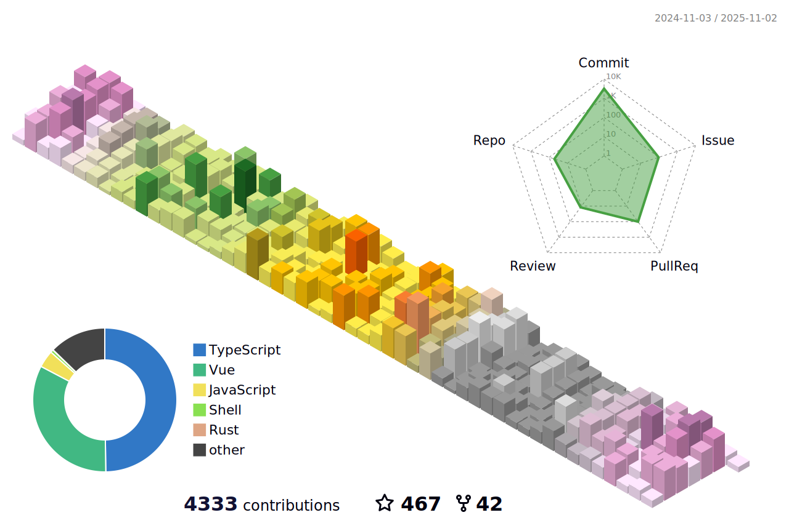

<h1 align="center">
  
</h1>

  
  
  
  
  

---

## About Me

Frontend engineer focused on tooling, automation, and developer experience.

- Build practical open-source tools for real workflows
- Improve DX and performance in frontend projects
- Keep things simple, maintainable, and fast

---

## Open Source Projects

### Tools & Utilities
- [`lazy-js-utils`](https://github.com/Simon-He95/lazy-js-utils): JavaScript/TypeScript utility toolkit.
- [`unot`](https://github.com/Simon-He95/unot): UnoCSS toolkit for improved workflow.

### VSCode Extensions
- [`vscode-common-intellisense`](https://github.com/Simon-He95/vscode-common-intellisense): universal component IntelliSense.
- [`vscode-tailwind-magic`](https://github.com/Simon-He95/vscode-tailwind-magic): TailwindCSS productivity extension.
- [`markstream-vue`](https://github.com/Simon-He95/markstream-vue): dynamic Vue component metadata support.

### Web Applications
- [`simon.me`](https://github.com/Simon-He95/simon.me): personal blog and content platform.
- [`browser-compress-image`](https://github.com/Simon-He95/browser-compress-image): browser-side image compression.
- [`transformToUnocss`](https://github.com/Simon-He95/transformToUnocss): convert traditional CSS to UnoCSS utilities.

---

## GitHub Statistics

  
  
  
  

---

## Activity

  
  
  

---

## Coding Time

  
  

---

## Tech Stack

  
  
  
  
  
  

---

## Support

  
    
  

