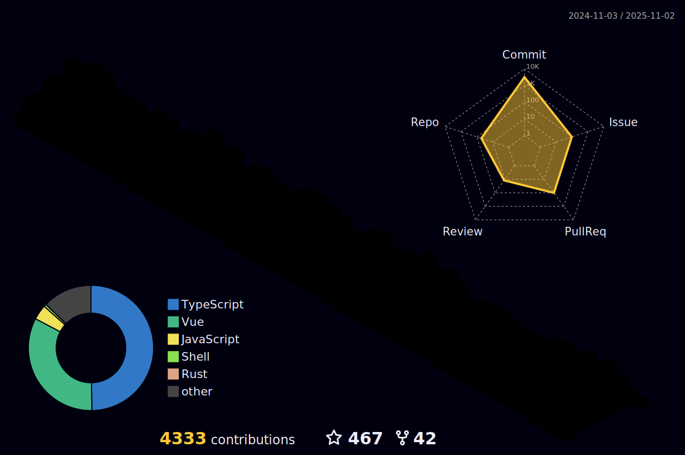

<div align="center">
  <h1>SIMON HE · FRONTEND ENGINEER</h1>
  <p><code>frontend-engineer --tooling --automation --open-source</code></p>
</div>

<p align="center">
  <a href="https://simonhe.me/"></a>
  <a href="https://twitter.com/simon_he1995"></a>
  <a href="https://space.bilibili.com/413596956"></a>
  <a href="https://www.npmjs.com/~simon_he"></a>
</p>

<p align="center">
  
</p>

## /identity

```bash
$ whoami
Simon He (Simon-He95)

$ cat focus.txt
- frontend engineering
- build tooling and automation
- practical DX improvements
```

## /featured_repos

- [`simon-js-tool`](https://github.com/Simon-He95/simon-js-tool)  
  Utility toolkit for daily JavaScript and TypeScript workflows.
- [`tiny-tinify-compress`](https://github.com/Simon-He95/tiny-tinify-compress)  
  Lightweight image compression helper focused on practical usage.
- [`browser-compress-image`](https://github.com/Simon-He95/browser-compress-image)  
  Browser-side image compression library with strong performance.
- [`transformToUnocss`](https://github.com/Simon-He95/transformToUnocss)  
  Convert CSS styles into UnoCSS utilities for faster migration.

## /contribution_matrix

<p align="center">
  
</p>

<p align="center">
  
</p>

## /core_telemetry

<p align="center">
  
</p>

<p align="center">
  
  
  
  
</p>

## /live_external_feeds

<p align="center">
  
</p>

<p align="center">
  
  
</p>

<p align="center">
  
</p>

## /support

[Buy me a cup of coffee](https://github.com/Simon-He95/sponsor)
